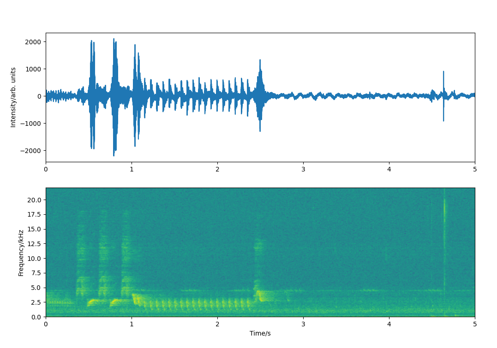

# BIRDSONG SPECTROGRAM

First attempts to perform a Birdsong Spectrogram with Python utilizing MATPLOTLIB. Its relatively fast updates 
are achieved through blitting. However, due to the amount of data to be displayed it is relatively slow (about 5 fps).
All that's required is a quality inboard-microphone configured to at least 44100 samples/second.

On UNIX OS please consider to run the package with sudo rights, owing to the particular requirement of the keyboard
module: sudo python3 -m BirdsongSpectrogram

You may want to test and enjoy it with [link to youtube!](https://www.youtube.com/watch?v=NK2_bcQcoD4)

It'll look like this:

Anyone is welcome for revisions and suggestions.